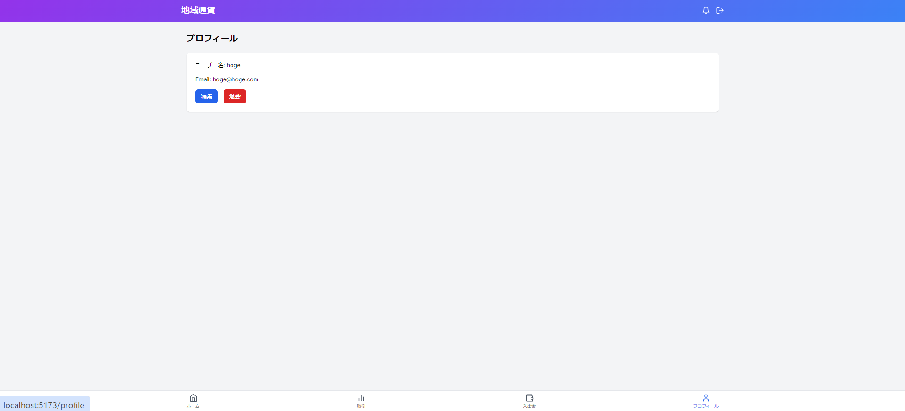
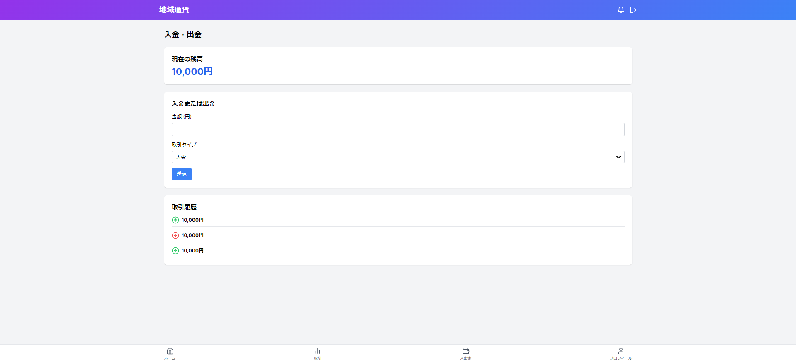
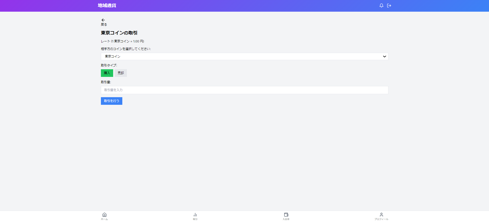
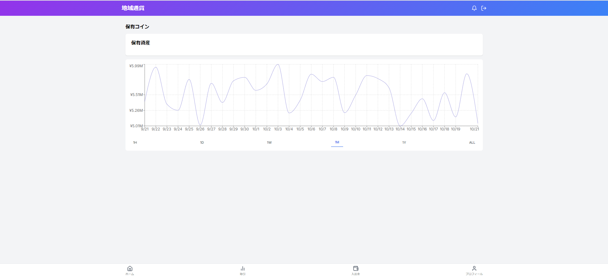

**※：DDLはメンテ済み。**  
**※：openapiはメンテしてない。**


# 日本地域通貨取引プラットフォーム

## スクリーンショット
**プロフィール画面**

**入出金画面**

**通貨取引画面**

**ダッシュボード画面**


## システム概要

日本地域通貨取引プラットフォームは、地域通貨をオンラインでトレードできるシステムを提供します。ユーザーはリアルタイムの市場レートに基づいて、地域通貨を売買することができ、需要と供給に応じたレートで取引が実行されます。

本プラットフォームの主な目的は、地域通貨の利用を促進し、日本の地域経済の活性化を目指すものです。ユーザーは、自身のウォレットを管理し、円（JPY）および地域通貨の残高を確認しながら取引を行うことができます。

## システムの目的と特徴

- **日本の地域通貨をトレードできるオンラインプラットフォームを提供**
  - ユーザーが日本各地の地域通貨をオンラインで取引できる環境を提供します。
  
- **需要と供給に基づいたレートで地域通貨の売買を可能にする**
  - 売買注文が市場の需給バランスに基づいてリアルタイムでマッチングされ、最適なレートで取引が行われます。

## 主要な機能

### 1. ユーザー登録と認証機能
- **新規ユーザー登録**: ユーザーはアカウントを作成し、システムに登録できます。
- **認証機能**: ユーザーは、メールアドレスとパスワードを使用してログインし、自身のウォレットや取引を管理します。

### 2. 地域通貨の一覧表示
- 取引可能な地域通貨のリストを表示し、ユーザーはどの通貨を売買できるかを確認できます。

### 3. リアルタイムの市場レート表示
- **需要と供給に基づくレート更新**: プラットフォームは1分ごとに市場の需要と供給に基づいたレートを自動で更新します。
- **WebSocketによるリアルタイム表示**: レート情報はWebSocketを通じてリアルタイムでクライアントに通知されます。

### 4. 売買注文の作成と管理
- **注文作成**: ユーザーは、買い注文または売り注文を作成することができます。
- **注文管理**: 作成した注文を一覧表示し、キャンセルや修正を行えます。

### 5. 注文のマッチングと取引の実行
- 売買注文は自動的にマッチングされ、取引が成立した際にはそのレートで実行されます。
- **取引の自動実行**: マッチングされた注文は即座に完了し、ユーザーのウォレットに反映されます。

### 6. ユーザーウォレット機能
- ユーザーは地域通貨と円の残高を管理できます。
- **デジタルウォレット**: 地域通貨および円の預入・引出が可能です。地域通貨の名前も管理します。
- **ウォレット履歴**: 過去の取引やウォレットの操作履歴が記録され、ユーザーはいつでも確認できます。

### 7. 取引履歴とアカウント管理
- **取引履歴**: ユーザーは過去の取引履歴を閲覧し、取引の詳細を確認できます。
- **アカウント管理**: ユーザーは自身のアカウント情報を管理し、必要に応じて更新できます。

## 技術スタック

- **バックエンド**: Spring Boot
- **フロントエンド**: React, TypeScript, TailwindCSS, WebSocket
- **データベース**: MySQL
- **リアルタイム通信**: WebSocket (STOMP)
- **スケジューリング**: Spring Schedulingによる定期的なレート更新

## ディレクトリ構造

```
/src
  /main
    /java/com/example/currency
      /controller   # APIコントローラ
      /domain       # ドメインモデル (エンティティ)
      /repository   # データアクセス用リポジトリ
      /service      # ビジネスロジック
      /websocket    # WebSocket設定
  /test
    /java/com/example/currency  # テスト
  /resources
    /application.properties  # 設定ファイル
```

## APIエンドポイント

### ユーザー管理
- `GET /api/users` - 全ユーザーの取得
- `POST /api/users` - 新規ユーザー登録
- `DELETE /api/users/{userId}` - ユーザー削除
- `PUT /api/users/{userId}` - ユーザー情報の更新

### ウォレット管理
- `GET /api/wallets?userId={userId}` - 指定ユーザーのウォレット情報取得
- `POST /api/wallets` - ウォレット作成
- `PUT /api/wallets/{walletId}` - ウォレットの更新

### 取引管理
- `GET /api/trades?userId={userId}` - 指定ユーザーの取引情報取得
- `POST /api/trades` - 新規取引作成
- `POST /api/trades/match` - 取引マッチング処理

### 取引履歴
- `GET /api/trade-history?userId={userId}` - 指定ユーザーの取引履歴取得

### レート管理
- `GET /api/rates` - 最新レートの取得
- `POST /api/rates` - レートの手動更新（管理者用）

### WebSocket
- **WebSocket URL**: `/ws` - リアルタイム通信のためのWebSocketエンドポイント
- **レート更新のサブスクリプション**: `/topic/rates` - リアルタイムレート更新情報の購読

## データベース設計

### users テーブル
```sql
CREATE TABLE users (
    user_id BIGINT AUTO_INCREMENT PRIMARY KEY,
    username VARCHAR(50) NOT NULL UNIQUE,
    email VARCHAR(100) NOT NULL UNIQUE,
    password_hash VARCHAR(255) NOT NULL,
    created_at TIMESTAMP DEFAULT CURRENT_TIMESTAMP,
    updated_at TIMESTAMP DEFAULT CURRENT_TIMESTAMP ON UPDATE CURRENT_TIMESTAMP
);
```

### wallets テーブル
```sql
CREATE TABLE wallets (
    wallet_id BIGINT AUTO_INCREMENT PRIMARY KEY,
    user_id BIGINT NOT NULL,
    currency_type ENUM('LOCAL_CURRENCY', 'CASH') NOT NULL,
    local_currency_name VARCHAR(100), -- 地域通貨の名前を追加
    balance DECIMAL(18, 8) NOT NULL DEFAULT 0.0,
    created_at TIMESTAMP DEFAULT CURRENT_TIMESTAMP,
    updated_at TIMESTAMP DEFAULT CURRENT_TIMESTAMP ON UPDATE CURRENT_TIMESTAMP,
    FOREIGN KEY (user_id) REFERENCES users(user_id) ON DELETE CASCADE
);
```

### trades テーブル
```sql
CREATE TABLE trades (
    trade_id BIGINT AUTO_INCREMENT PRIMARY KEY,
    user_id BIGINT NOT NULL,
    trade_type ENUM('BUY', 'SELL') NOT NULL,
    amount DECIMAL(18, 8) NOT NULL,
    rate DECIMAL(18, 8) NOT NULL,
    status ENUM('OPEN', 'COMPLETED', 'CANCELLED') NOT NULL DEFAULT 'OPEN',
    matched_trade_id BIGINT,
    matched_rate DECIMAL(18, 8),
    matched_at TIMESTAMP,
    completed_at TIMESTAMP,
    local_currency_name VARCHAR(100), -- 地域通貨の名前を追加
    created_at TIMESTAMP DEFAULT CURRENT_TIMESTAMP,
    updated_at TIMESTAMP DEFAULT CURRENT_TIMESTAMP ON UPDATE CURRENT_TIMESTAMP,
    FOREIGN KEY (user_id) REFERENCES users(user_id) ON DELETE CASCADE
);
```

### trade_history テーブル
```sql
CREATE TABLE trade_history (
    history_id BIGINT AUTO_INCREMENT PRIMARY KEY,
    user_id BIGINT NOT NULL,
    trade_id BIGINT NOT NULL,
    trade_type ENUM('BUY', 'SELL') NOT NULL,
    amount DECIMAL(18, 8) NOT NULL,
    rate DECIMAL(18, 8) NOT NULL,
    completed_at TIMESTAMP DEFAULT CURRENT_TIMESTAMP,
    local_currency_name VARCHAR(100), -- 地域通貨の名前を追加
    FOREIGN KEY (user_id) REFERENCES users(user_id) ON DELETE CASCADE,
    FOREIGN KEY (trade_id) REFERENCES trades(trade_id) ON DELETE CASCADE
);
```

### rates テーブル
```sql
CREATE TABLE rates (
    rate_id

 BIGINT AUTO_INCREMENT PRIMARY KEY,
    numerator_currency VARCHAR(100) NOT NULL,  -- 分子の通貨名（例: LOCAL_CURRENCY）
    denominator_currency VARCHAR(100) NOT NULL,  -- 分母の通貨名（例: CASH）
    rate DECIMAL(18, 8) NOT NULL,
    created_at TIMESTAMP DEFAULT CURRENT_TIMESTAMP
);
```

### wallet_transactions テーブル
```sql
CREATE TABLE wallet_transactions (
    transaction_id BIGINT AUTO_INCREMENT PRIMARY KEY,
    wallet_id BIGINT NOT NULL,
    transaction_type ENUM('DEPOSIT', 'WITHDRAWAL') NOT NULL,
    amount DECIMAL(18, 8) NOT NULL,
    balance_after DECIMAL(18, 8) NOT NULL,
    created_at TIMESTAMP DEFAULT CURRENT_TIMESTAMP,
    FOREIGN KEY (wallet_id) REFERENCES wallets(wallet_id) ON DELETE CASCADE
);
```

## 依存関係

### バックエンド依存 (pom.xml)
```xml
<dependencies>
    <!-- Spring Boot Data JPA and Web -->
    <dependency>
        <groupId>org.springframework.boot</groupId>
        <artifactId>spring-boot-starter-data-jpa</artifactId>
    </dependency>
    <dependency>
        <groupId>org.springframework.boot</groupId>
        <artifactId>spring-boot-starter-web</artifactId>
    </dependency>

    <!-- WebSocket support -->
    <dependency>
        <groupId>org.springframework.boot</groupId>
        <artifactId>spring-boot-starter-websocket</artifactId>
    </dependency>

    <!-- MySQL Driver -->
    <dependency>
        <groupId>mysql</groupId>
        <artifactId>mysql-connector-java</artifactId>
        <scope>runtime</scope>
    </dependency>

    <!-- Spring Boot Validation -->
    <dependency>
        <groupId>org.springframework.boot</groupId>
        <artifactId>spring-boot-starter-validation</artifactId>
    </dependency>

    <!-- Test dependencies -->
    <dependency>
        <groupId>org.springframework.boot</groupId>
        <artifactId>spring-boot-starter-test</artifactId>
        <scope>test</scope>
    </dependency>
</dependencies>
```

### フロントエンド依存
```json
{
  "dependencies": {
    "react": "^18.3.1",
    "react-dom": "^18.3.1",
    "react-router-dom": "^6.22.3",
    "socket.io-client": "^4.7.4",
    "axios": "^1.6.7"
  },
  "devDependencies": {
    "vite": "^5.4.2",
    "typescript": "^5.5.3",
    "tailwindcss": "^3.4.1"
  }
}
```
